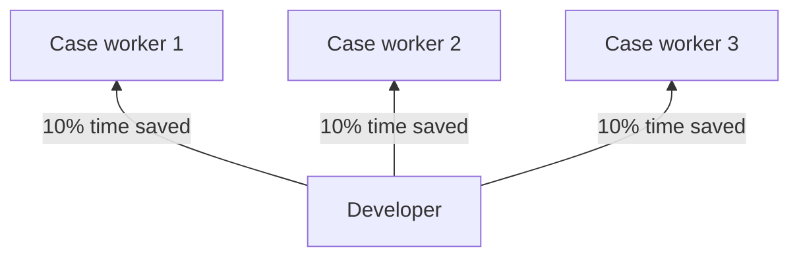

## Principles

General guidelines that seems logical to me

### Optimise recurring developer tasks

Developers are often supporting other roles in a organization. 10 case workers might be waiting for a developer to make a process go faster. If this is the case, protecting the time of the developer more than that of the case workers saves money.

Developers are one of few roles in an organization that have a great power in optimizing their own work. Not making use of this unique ability seems uneconomical. If a developer does the same work 10% faster the next year, it might save the organization more than 10% if several people depend on the developer.

In my experience, process optimisations must often be prioritised and implemented by the developer herself. Example: improvements of a slow and unstable deploy pipeline. Especially product owners will have a hard time prioritising this. The big problem, is that as time goes on, there will sometimes be more and more things to do. New features might have to be developed to increase income, but developing them might take longer and longer time. For example because of technical debt. And if a feature takes longer to develop, cost have gone up, and it might be needed to develop more features to cover the cost, again... In this case, if the company is not at the verge of bankruptcy, I would say it is the responsibility of the developer to optimise themselves.

### Use metrics instead of guesswork

### Should be able to learn from mistakes

I simply believe that if someone created a bug, they should be notified. You are a good colleage if you tell the one who made the bug, don't fix it silently. Learning from mistakes also implies that one need monitoring, quality control and incident postmortem.

### Short feedback loops

Let's say I write some short JavaScript code in a codebase. If I have to deploy it to see if it works; I might create a PR to `develop`, get code review and then deploy. We probably spent many hours, I assume at least 4, to see that it failed. To get a shorter feedback loop, we could allow feature branches to be deployed. Even shorter if I could run locally. And even shorter than that if some tool (like linter or compiler) could point out the error while writing the code.

Writing this out this seems obvious, but I have been on several projects where people didn't have access to databases and didn't take the time setting up local ones. Instead one used several hours deploying each time. (And making the db unusable for all the other devs at the same time, because of db migrations).

### Focus on having completely local environment

If devs have a shared development environment (e.g. shared database, shared Azure Service Bus) they will obstruct each other. A local dev environment scales! And a local dev env often leads to short feedback loops and thus optimises recurring tasks.

### Everyone takes responsiblity

"If you see a bug, you own it".

### In it as a team

No specific individual is to blame

## Documentation

Some documentation is important!

TL;DR:

README.md in source code

* How to run
* Data flow and code organization

API or library documentation

* Open API and Async API
* Documentation generation (from source code and doc strings); mostly used for libraries

Easy editable and searchable tool

* Software in context
* Support routines

### How to run

From almost all code I've worked with I've found it is necessary to have documentation on how to run the code. The project might run with the standard `npm i` then `npm run-script start` command in terminal. However people unfamiliar with NPM wouldn't know this or what to search for; they simply wouldn't know the package manager is NPM. And I have myself forgotten all the tiny details on how to run my own projects.

How to run can change often. For example new environment variables are added all the time. And then the documentation must be read and updated often together with code changes. Thus it makes a lot of sense to store information on how to run in a toplevel README.md file in the repo.

In general documentation stored outside of the repo has a greater risk of getting outdated, lost, or you might not have acces to it even though you have the code.

Despite the need for documenting how to run, I want to mention here I strongly believe it should be as few steps as possible to make the code run locally. Good examples follows:

* A script in `package.json`
* Runfile for IntelliJ
* `launch.json` for VS Code

### Support routines

If you are maintaining several (micro) services having a searchable wiki helps tremendously. Then you can simply search the entire knowledge base for solutions if the problem has arised before. AFAIK, searchability is a downside with having information inside code repositories. Also, Word files in Sharepoint is equally unsearchable, in my experience. The wiki **must** be searchable! And preferably easy editable so anyone can quickly update it with new correct information.

I have found Confluence Cloud to work great.

And to those who says the docs on Confluence is one pile of outdated trash. The truth is that is your (teams') fault. The only way to have updated documentation is to update it yourself. A team culture of taking responsibility helps. Code reviews that include checking documentation can help. Assuming here that you do use Open API for API documentation and README.md for other very code specific documentation.

Knowing when not to document is also something to think about. Implementation details are more quickly changing that architecture. The goal should be to have as little documentation as possible that still is enough.

Note: Now that AI is beginning to get on par with humans it might be a solution to this outdated doc problem.

## Configuration

### Environment files

Confguration should be stored in such a way that it is easy to run the code locally.

For Python and JS it can be the following files; `prod.env`, `test.env` and `local.env`. Here we have two environments to deploy to, and one local. To run the code one copy one of these files to a file named `.env`.

---
Last updated March 2023

Comments on this text? [Create an issue on Github!](https://github.com/Sti2nd/sti2nd.github.io/issues)
