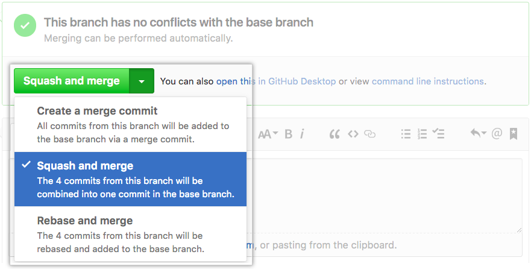
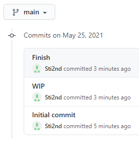
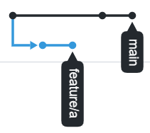
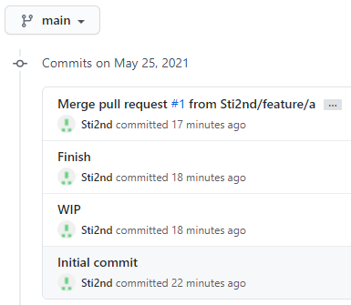
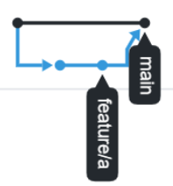
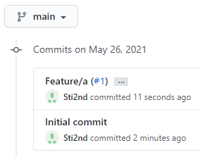
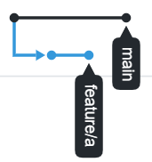

There are many git branching strategies out there. Popular alternatives I have come across are: [git-flow](https://nvie.com/posts/a-successful-git-branching-model/), [GitHub flow](https://guides.github.com/introduction/flow/) and [GitLab flow](https://docs.gitlab.com/ee/topics/gitlab_flow.html). We will not discuss which git branching strategy to use, but the smaller problem; what kind of merge should I do when merging my pull requests (PRs). You might have noticed these options at your git host when merging a pull request:

1. Create a merge commit (--no-ff)
2. Squash and merge
3. Rebase and merge

The following image is how it looks on GitHub.

> TL;DR: Use squash.

## The problem: WIP commits

In all the previously mentioned branching strategies a developer works in their own feature branch. On this branch, the developer creates as many or as few commits as he/she wants. Some examples of commits, can be "set up skeleton", "WIP", "finish feature". WIP is by the way an acronym of Work In Progress. What the developer does in this feature branch others don't have to care about; until the feature branch goes into a main branch such as `main`, that is.

When the feature branch is merged into `main`, depending on which type of merge was done; the commits are also merged into `main`. This is can lead to problems as the history of the main branch is now cluttered with commits like "WIP" and "setting up skeleton". Commits before the last commit on a feature branch are likely to contain code that is not working properly and thus we never want to revert to these commits. Since the commits happen to be in the main branch reverting to them can unfortunately happen.

Let's take a look at the different merge options. In the following examples I first created an "Initial commit" on the `main` branch and then two commits on branch `feature/a`; "WIP" and "Finish", before finally merging `feature/a` into `main`.

### Rebase

If the option "Rebase and merge" is chosen, a `git rebase` is performed and results in the following commit history in `main`.

The linear history contains all commits from the feature branch. It is very difficult to understand which commits contains working code; it could be that "Finish" means the feature is finished, or does it mean something else? Unless someone can read the mind of this developer remotely, we may never know. The graph view of the commit history isn't of much help either.

Rebase can be great for updating your local feature branch without creating an unecessary merge-commit. The problem with using it to merge a PR is that it requires all commits on the feature branch to be sensible and a working copy of the software. One could require that all developers must do an [interactive rebase](https://git-scm.com/docs/git-rebase#_interactive_mode) before creating the PR, or simply avoid rebase for merging PRs from feature branches.

### Merge without fast-forward

If the option "Create a merge commit" is chosen, a `git merge` with the `--no-ff` flag set is performed and we get the following commit history in `main`.

The linear history contains all commits from the feature branch. There is a merge commit (the topmost commit in the image) so one might think it would be safe to assume the merge commit marks a working copy of the software. This is not true! A developer working on another feature branch could have merged `feature/a` into their local branch and we cannot from the linear history know where this merge commit comes from. The information on which branch the commits are originally from can be viewed in a graph view.

Here we see that the merge commit indeed was created by merging `feature/a` into `main`.

The [git-flow](https://nvie.com/posts/a-successful-git-branching-model/) branching strategy mentions this way of merging. It is possible to find out where the safe commits are, but there is still the problem of useless commits on `main`. And I believe one should not make it essential to view the history as a graph before reverting a commit on `main`.

## Squash

If the option "Squash and merge" is chosen, the git hosting provider takes care of squashing the commits into one new commit.

The linear history is as clean as it can be. The original developer commits are not in `main` and instead we have a much better merge commit that describes the feature. And we can be sure all these commits represents a working version of the software and can be safely reverted to.

The graph view is just as useless as for rebase, but we don't really need it. The feature has been merged into `main`, so we might as well delete the feature branch at this point.

### Things to look out for

Things to look out for when using squash and merge:

- If one are going to continue working on the feature branch after merging a PR, then using `squash` can create more merge conflicts, [as explained by GitHub](https://docs.github.com/en/github/collaborating-with-pull-requests/incorporating-changes-from-a-pull-request/about-pull-request-merges#squashing-and-merging-a-long-running-branch). I suggest squashing the commits on your local branch first with [interactive rebase](https://git-scm.com/docs/git-rebase#_interactive_mode) before rebasing or merging without fast-forward.
  - If the branching strategy you have chosen consists of merging long-running feature branches several times into the main branch, squashing as default is perhaps non-optimal. The three branching strategies I linked in the beginning does not do this, as far as I know.

## Conclusion

Use the "Squash and merge" option as default when merging features into main! This will keep the linear history of the main branch clean and one will be unable to revert to a commit with code that doesn't work.

---
Last updated May 26 2021

Comments on this text? [Create an issue on Github!](https://github.com/Sti2nd/sti2nd.github.io/issues)
